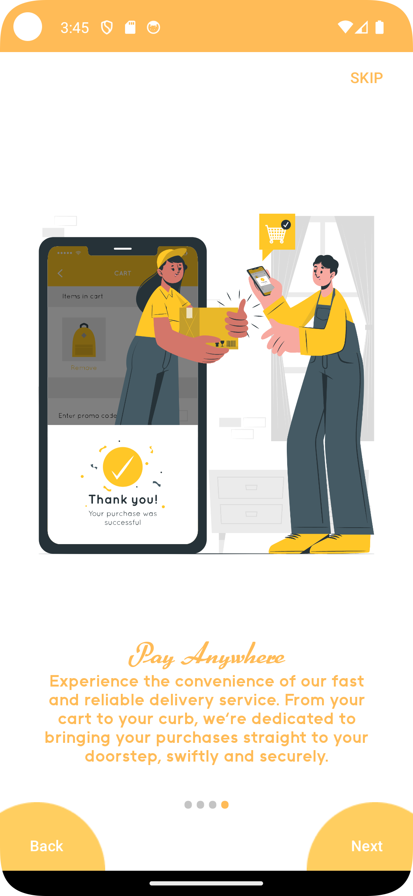
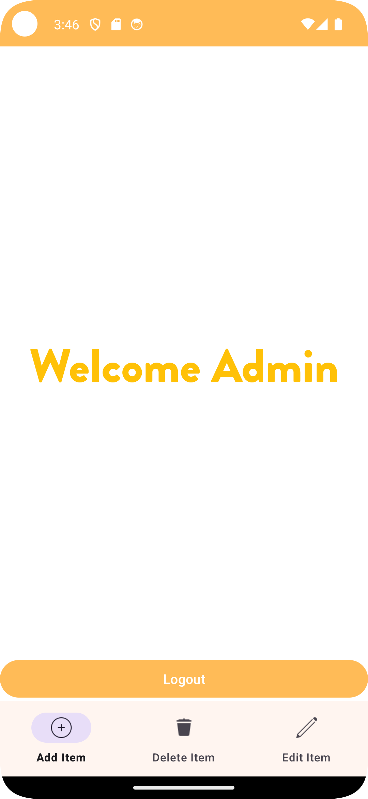
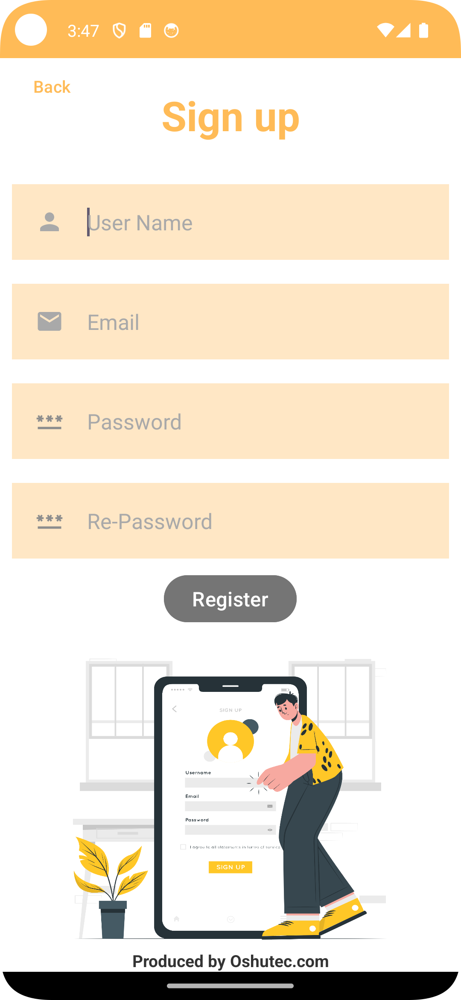
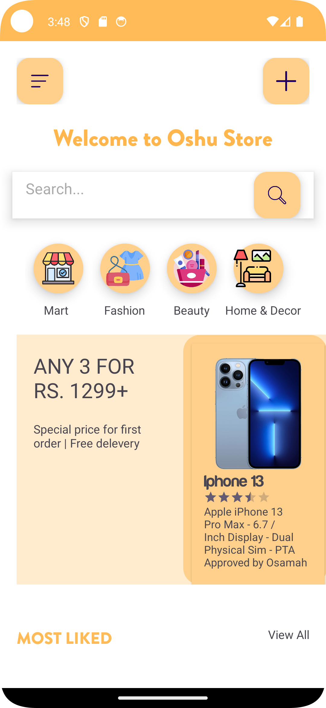
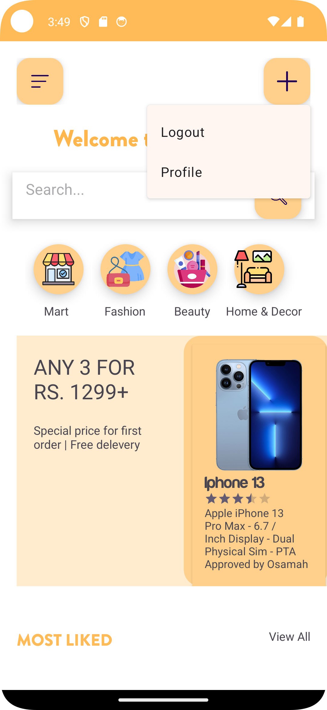
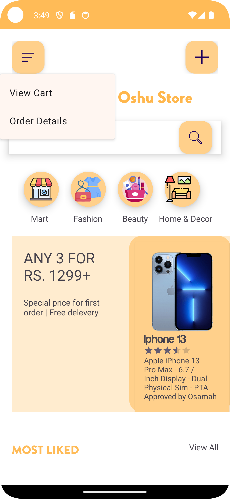

# Oshu Store

<div align="center">


**A complete Android e-commerce solution with dual Admin/User interfaces**

[Features](#features) • [Firebase Setup](#firebase-integration) • [Installation](#installation) • [Usage](#usage)

</div>

---

A production-ready Android shopping app demonstrating modern mobile development practices. Features separate admin dashboard for inventory management and customer interface for seamless shopping experience. Perfect for learning Android development, Firebase integration, and SQLite database management.

## What Makes This Project Special

This isn't just another shopping app. Oshu Store demonstrates:

- **Dual-role architecture** - Separate admin and customer experiences in one app
- **Real-world patterns** - Firebase Authentication, SQLite database, Material Design
- **Complete workflow** - From product creation to customer purchase
- **Production-ready structure** - Clean code organization, proper error handling
- **Learning resource** - Well-documented code perfect for Android developers

Perfect for portfolio projects, learning Android development, or as a foundation for your own e-commerce app.

## Screenshots

<div align="center">

| | |
|:-------------------------:|:-------------------------:|
| Login Screen |  Sign Up |
| Onboarding |  Main Store |
| Product Details |  All Products |
| Cart View |  Admin Dashboard |
| Add Product |  Edit Product |
| Delete Product | |

</div>

## Features

### Admin Dashboard
- **Add Products** - Upload images, set names and descriptions
- **Edit Products** - Update product information instantly
- **Delete Products** - Remove items with confirmation
- **Bottom Navigation** - Quick access to all management functions
- **Secure Access** - Email-based admin authentication

### Customer Experience
- **Product Catalog** - Browse featured and all products
- **Product Details** - Full product information and images
- **Shopping Cart** - Add and manage items
- **Search** - Find products quickly
- **Onboarding** - Smooth first-time user experience
- **Authentication** - Secure signup and login

## Firebase Integration 

This app uses Firebase Authentication for user management. Follow these steps to set up Firebase:

### Step 1: Create Firebase Project

1. Go to [Firebase Console](https://console.firebase.google.com)
2. Click "Add project" or select an existing project
3. Enter your project name and follow the setup wizard
4. Accept the terms and click "Create project"

### Step 2: Add Android App to Firebase

1. In your Firebase project, click the Android icon to add an Android app
2. Enter the package name: `com.oshu.store`
3. Register the app and download `google-services.json`

### Step 3: Configure Authentication

1. In Firebase Console, navigate to **Authentication** → **Sign-in method**
2. Enable **Email/Password** provider
3. Click "Save"

### Step 4: Add Configuration File

1. Copy the downloaded `google-services.json` file
2. Place it in the `app/` directory (same level as `build.gradle.kts`)
3. The file structure should be:
   ```
   app/
   ├── google-services.json
   ├── build.gradle.kts
   └── src/
   ```

**Note**: The `google-services.json` file contains sensitive API keys and is excluded from version control. Use the provided `google-services.json.example` as a reference for the required structure.

## Admin Account Setup

Admin access is determined by email address. The admin email is hardcoded in the application:

- **Admin Email**: `email@example.com`

### Creating an Admin Account

1. **Set up Firebase** (follow steps above)
2. **Create the admin account**:
   - Open the app and navigate to Sign Up
   - Register with the email: `email@example.com`
   - Choose any password (remember it for login)
3. **Login as admin**:
   - Use `email@example.com` and your password
   - You'll be automatically redirected to the Admin Dashboard

**Important**: To change the admin email, modify the `isUserAdmin()` method in `Login.java` and replace `email@example.com` with your desired admin email address.

### Adding Products as Admin

1. Log in with the admin account
2. Navigate to the **Add** tab in the bottom navigation
3. Fill in product details:
   - Product name
   - Product description
   - Product image (select from device)
4. Click "Add Product"
5. Products will appear in the user interface immediately

## Quick Start

### Prerequisites
- Android Studio (latest version)
- Android SDK API 24+
- JDK 8+
- Firebase account (free tier works)

### Installation

```bash
# Clone the repository
git clone https://github.com/yourusername/onlineshoppingapp.git
cd onlineshoppingapp
```

1. **Set up Firebase** (see [Firebase Integration](#firebase-integration) section)
2. **Place `google-services.json`** in the `app/` directory
3. **Open in Android Studio** and wait for Gradle sync
4. **Run on emulator** or physical device

That's it! The app will build and run. Create an admin account using `email@example.com` to access the admin dashboard.

## Usage

### For Administrators

1. Log in with the admin email (`email@example.com`)
2. Access the admin dashboard with bottom navigation:
   - **Add**: Create new product listings
   - **Edit**: Modify existing product details
   - **Delete**: Remove products from inventory
3. All changes are saved immediately to the SQLite database
4. Products added by admin will appear in the user interface

### For Customers

1. Complete the onboarding screens on first launch
2. Create an account or log in with existing credentials
3. Browse featured products on the main screen
4. Tap "View All" to see the complete product catalog
5. Select any product to view detailed information
6. Add items to cart using the floating action button
7. Use the search functionality to find specific products

## Project Structure

```
app/src/main/java/com/oshu/store/
├── MainActivity.java          # Entry point and onboarding
├── Login.java                 # User authentication with admin check
├── Signup.java                 # Account creation
├── MainScreen.java            # Customer product browsing interface
├── DatabaseHelper.java        # SQLite database operations
├── ProductsMain/              # Product-related activities
│   ├── AllProductsActivity.java
│   ├── ProductDetailsFragment.java
│   └── CartView.java
├── Admin/                     # Administrative functions
│   ├── AdminActivity.java
│   ├── AddItemFragment.java
│   ├── EditItemFragment.java
│   ├── DeleteItemFragment.java
│   └── DetailsFragment.java
└── HelperClasses/             # Reusable components
    ├── FeaturedAdapter.java
    ├── SimpleAdapter.java
    └── FeaturedHelperClass.java
```

## Technologies

- **Android SDK** - Native Android development
- **Java** - Primary programming language
- **Firebase Authentication** - User authentication and session management
- **SQLite** - Local database for product storage
- **Material Design Components** - Modern UI components
- **Glide** - Image loading and caching
- **RecyclerView** - Efficient list rendering

## Requirements

- **Minimum Android Version**: 7.0 (API level 24)
- **Target Android Version**: 13.0 (API level 33)
- **RAM**: 2GB minimum, 4GB recommended
- **Storage**: 50MB for app installation
- **Internet**: Required for Firebase Authentication

## Contributing

Contributions are welcome. Please follow these steps:

1. Fork the repository
2. Create a feature branch (`git checkout -b feature/amazing-feature`)
3. Commit your changes (`git commit -m 'Add some amazing feature'`)
4. Push to the branch (`git push origin feature/amazing-feature`)
5. Open a Pull Request

## Tech Stack

- **Language**: Java
- **Platform**: Android (Native)
- **Authentication**: Firebase Auth
- **Database**: SQLite
- **UI**: Material Design Components
- **Image Loading**: Glide
- **Architecture**: MVC with Fragments

## Contributing

Found a bug or have a feature idea? Contributions are welcome!

1. Fork the repository
2. Create your feature branch (`git checkout -b feature/amazing-feature`)
3. Commit your changes (`git commit -m 'Add amazing feature'`)
4. Push to the branch (`git push origin feature/amazing-feature`)
5. Open a Pull Request

## License

This project is open source and available for educational purposes. Feel free to use it as a learning resource or starting point for your own projects.

---

<div align="center">

**⭐ If you find this project helpful, consider giving it a star! ⭐**

Made with ❤️ for the Android developer community

</div>
